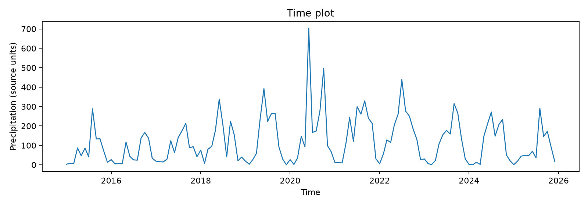
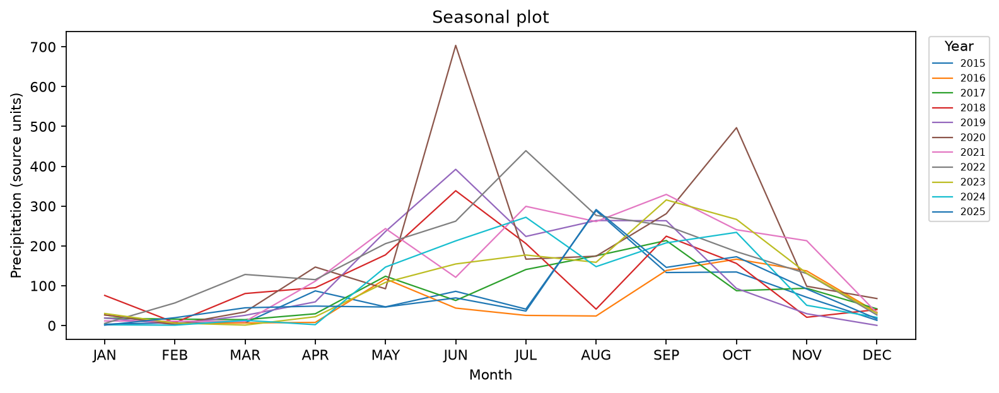
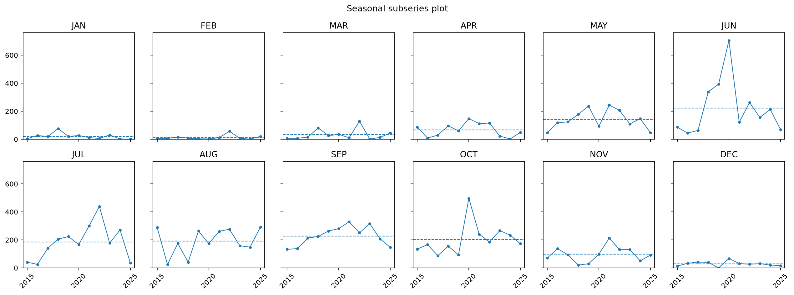

# Phnom Penh Precipitation Time-Series Analysis (2015–2025)

**University:** (RUPP)Royal University of Phnom Penh
**Major:** Data Science and Engineering, Year 3
**Professor:** Chim Seyha
**Course:** Time Series Analysis (TSA)  
**Student:** Heng Sengthay

## Project Overview
This repository contains an exploratory time-series analysis of monthly precipitation data for Phnom Penh, Cambodia, spanning from 2015 to 2025. The primary objective of this project is to inspect, reshape, and visualize chronological data to identify long-term trends, recurring seasonal patterns, and unusual weather events. 

## Repository Structure
The project files are organized as follows:

├── data/
│   └── phnom_penh_monthly_precipitation_2015_2025_long.csv  # Reshaped long-format dataset
├── figures/
│   ├──                                      
│   ├──                                 
│   └── 
└── notebooks/
    └── TSA_Week2_Phnom_Penh_Rainfall_Lab.ipynb              # Main Jupyter/Colab notebook

## **Key Findings**
Based on the visual and statistical exploration of the data:

- Distinct Seasonal Pattern: The region experiences a very clear dry season from January to April and November to December. The wet season spans from May to October, with September recording the highest average precipitation.

- Stable Long-Term Trend: Despite heavy seasonal fluctuations, the overall precipitation trend remains relatively stable over the 11-year period, with no obvious continuous long-term increase or decrease.

- Significant Anomalies: A massive, unusual precipitation spike was recorded in June 2020 (703.62 units), dwarfing the historical June average (222.41 units).

## **Data Source & Limitations**
The dataset is derived from NASA POWER gridded estimates (presumed parameter: **PRECTOTCORR_SUM**) near 11.56° N, 104.93° E.

 - Caution: These values are satellite-derived gridded estimates, not direct local rain gauge measurements from the ground in Phnom Penh. Metadata and specific source units must be verified before utilizing this data in official forecasting or publications.

## **Technologies Used**
- Python 3
- Pandas (Data manipulation, reshaping wide-to-long formats)
- Matplotlib (Data visualization)
- Jupyter / Google Colab

## ** How to Run**
1. Clone the repository to your local machine.

2. Ensure you have Python and the necessary libraries (**pandas**, **matplotlib**, **numpy**) installed.

3. **Open notebooks/TSA_Week2_Phnom_Penh_Rainfall_Lab.ipynb** using Jupyter Notebook, JupyterLab, or upload it to Google Colab to view the code and execute the cells.